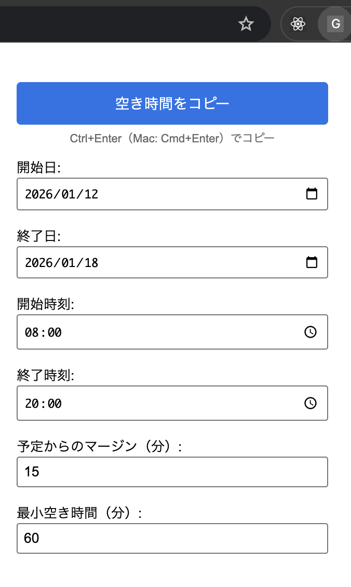

# Goodbye Google Grief (GGG / トリプルジー)

Google Calendarの空き時間を簡単にコピーできるChrome拡張機能です。



## 概要

Google Calendarで指定した日付範囲内の空き時間をテキスト形式でコピーできます。予定からのマージンや最小空き時間の設定も可能です。

## 機能

- 📅 **日付範囲の指定**: 開始日と終了日を指定して空き時間を抽出
- ⏰ **時間範囲の指定**: 1日の開始時刻と終了時刻を指定（デフォルト: 8:00-20:00）
- 🕐 **マージン設定**: 予定の前後にマージン（分）を設定可能（デフォルト: 15分）
- 📏 **最小空き時間**: 指定した時間（分）以下の空き時間は表示しない（デフォルト: 60分）
- ⌨️ **キーボードショートカット**: 
  - ポップアップを開いた状態で、`Ctrl+Enter`（Windows/Linux）または `Cmd+Enter`（Mac）でコピー実行
- 📋 **予定がない日付の通知**: コピー後に予定が見つからなかった日付を表示

## インストール方法

1. このリポジトリをクローンまたはダウンロード
2. Chromeで `chrome://extensions/` を開く
3. 「デベロッパーモード」を有効にする
4. 「パッケージ化されていない拡張機能を読み込む」をクリック
5. このプロジェクトのフォルダを選択

## 使用方法

1. Google Calendarを開く
2. 拡張機能のアイコンをクリック（または `Ctrl+Shift+E` / `Cmd+Shift+E`）
3. 以下の項目を設定：
   - **開始日**: 探索を開始する日付（デフォルト: 明日）
   - **終了日**: 探索を終了する日付（デフォルト: 今日から1週間後）
   - **開始時刻**: 1日の開始時刻（デフォルト: 8:00）
   - **終了時刻**: 1日の終了時刻（デフォルト: 20:00）
   - **予定からのマージン（分）**: 予定の前後に追加するマージン（デフォルト: 15分）
   - **最小空き時間（分）**: この時間以下の空き時間は表示しない（デフォルト: 60分）
4. 「空き時間をコピー」ボタンをクリック（または `Ctrl+Enter` / `Cmd+Enter`）
5. クリップボードに空き時間がコピーされます

## ⚠️ 注意事項

**現在ブラウザで表示している画面の予定のみが監視対象です。**

この拡張機能は、Google Calendarのページに表示されている予定のみを検出します。そのため、以下の点にご注意ください：

- カレンダーの表示範囲外の予定は検出されません
- 月表示、週表示、日表示など、現在表示しているビューに表示されている予定のみが対象です
- スクロールして表示されていない予定は検出されない可能性があります

**予定が見つからなかった日付について：**

コピー実行後、指定した日付範囲内で予定が見つからなかった日付がある場合、警告メッセージが表示されます。これは、以下の理由が考えられます：

- その日付に実際に予定がない
- その日付が現在のカレンダービューに表示されていない
- 予定が表示範囲外にある

正確な結果を得るためには、対象となる日付範囲がカレンダーに表示されている状態で実行してください。

## 出力形式

```
1/11(Sun) 8:00~10:00, 12:00~20:00
1/12(Mon) 8:00~14:00, 18:00~20:00
```

同じ日付の空き時間はカンマ区切りで同じ行に表示されます。

## 開発について

この拡張機能は**バイブコーディング**（Vibe Coding）で開発されました。バイブコーディングとは、直感的な感覚とリズムに基づいてコードを書く開発手法です。実装の過程では、Google CalendarのDOM構造を調査しながら、試行錯誤を重ねて機能を実装しました。

### 主な技術

- Chrome Extension Manifest V3
- Content Scripts
- Service Worker
- DOM操作とイベント処理

### ファイル構成

- `manifest.json`: 拡張機能の設定ファイル
- `popup.html`: ポップアップのUI
- `popup.js`: ポップアップのロジック
- `content.js`: Google Calendarページで実行されるスクリプト
- `background.js`: バックグラウンドサービスワーカー（キーボードショートカット処理）

## ライセンス

このプロジェクトはMITライセンスの下で公開されています。

## 作者

バイブコーディングで開発されました。
